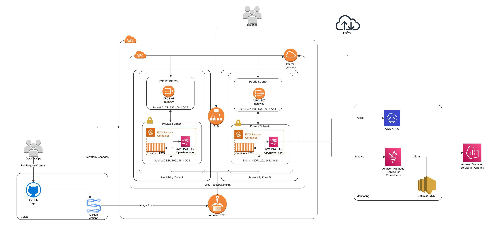

# NodeJS in ECS DevOps project

Projeto desenvolvido para efetuar deploy automatizado de uma aplicação NodeJS para a AWS utilizando Github Actions e Infraestrutura como código com Terraform.

Aplicação NodeJS consiste em uma busca básica na API da Wikipédia (baseada em: https://github.com/rat9615/simple-nodejs-app).

## Tecnologias utilizadas

- NodeJS
- Docker
- Terraform
- Github Actions
- Trivy
- AWS:
  - VPC (Virtual Private Cloud)
  - ECR (Elastic Container Registry)
  - ECS (Elastic Container Service)
  - ALB (Application Load Balancer)
  - ADOT (AWS Distro OpenTelemetry)
  - X-Ray
  - Amazon Managed Service for Prometheus
  - Amazon Managed Service for Grafana
  - Amazon SNS (Simple Notification Service)

## Infraestrutura

Para implantação, foi utilizado serviços e melhores práticas na AWS para garantir segurança, confiabilidade, alta disponibilidade e menor sobrecarga operacional. 

### Estrutura do cluster ECS
Toda a estrutura montada na AWS foi feita utilzando o Terraform, aplicando o conceito de Infraestrutura do Código. Sobre a estrutura, vale ressaltar alguns pontos:

- Para guardar a imagem Docker da aplicação, foi utilizado o Amazon ECR (Elastic Container Registry), por ter fácil integração com o ECS e ser um registro de container privado;
- Buscando uma menor sobrecarga operacional de configuração/geraciamento do ambiente e custo conforme utilização, foi utilizado o ECS (Elastic Container Service) com o Fargate, serviço serverless que abstrai a necessidade de instâncias EC2;
- Buscando maior segurança, o serviço do ECS Fargate foi montado subredes privadas, que só pode ser acessada a partir do balanceador de carga. Na subrede pública existe apenas o gateway NAT, utilizada pelo ECS para acesso a internet, e o balanceador de carga;
- Para efetuar o balanceamento de carga entre os containers distribuidos na estrutura é utiliza o serviço ALB (Application Load Balancer). O mesmo também é um serviço serverless elástico, com pagamento conforme utilização;
- Buscando redundância e alta disponibilidade, toda a estrutura é replica entre subredes em diferentes zonas de disponibilidade.

#### Solução para monitoramento
Para o monitoramento to ambiente, foi projetado uma solução utilizando serviços nativos da AWS considerando simplicidade de implementação (por conta de intergrações nativas) e menor sobrecarga operacional ao implementar e manter o monitoramento.

- AWS Distro for OpenTelemetry: Serviço AWS para coletar métricas e traces que pode ser facilmente configurado como container sidecar da aplicação;
- AWS X-Ray: Serviço AWS que vai receber e análisar os traces enviados do OpenTelemetry;
- Amazon Managed Service for Prometheus: Prometheus gerenciado pela AWS, do qual recebe as métricas enviadas pelo OpenTelemetry. Reduz significativamente custos operacionais com configuração, upgrade e escalabilidade de servidores Prometheus;
- Amazon Managed Service for Grafana: Grafana gerenciado da AWS, do qual será utilizado para visualização gráfica do monitoramento. Fornece simples integração simples com Prometheus e X-Ray;
- Amazon SNS: Serviço de notificações gerenciado da AWS, utilizado para submeter alertas configurados no Alert Manager do Prometheus. Os alertas são submetidos em tópicos e podem ser recuperados posteriormente via Slack, E-mail ou Webhook.

### Processo de CI/CD
Ao acontecer commits/PRs na branch main, os worflows aplicam todos os códigos Terraform (para o caso de alteração na infraestrutura) e efetuam o build/deploy da aplicação no ECS.

- Dockerfile na raiz do projeto para construção do container com base na aplicação contida no diretório `src`
- Deploy:
    - Build e Push da imagem para repositório ECR;
    - Análise de vulnerabilidades da imagem com Trivy;
    - Deploy dos containers com a nova imagem no ECS.

- Terraform Check:
    - Validação de sintaxe dos manifestos Terraform.

- Terraform Plan:
    - Efetua o Plan e coloca um comentário na Pull Request com o arquivo.

- Terraform Apply:
    - Validação de sintaxe dos manifestos Terraform
